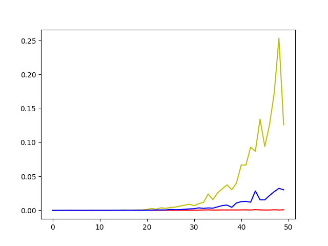

# Vaje 24. 02, Dinamično programiranje, 2.del

**Ime:** Gal Zakrajšek

**Datum:** 02.03.2021

---

Na vajah smo uporabljali funkcije, ki smo jih v skupinah prejšni teden sprogramirali. Vse so reševale problem najdaljšega narašajočega zaporedja
na različne načine. Nadaljevali smo z reševanjem v tomotu


## Komentarji in opombe

Všeč mi je bilo sodelovanje v skupinah in primerjava kode med različnimi skupinami. Tako smo videli kako so se ostali lotili merja
enja in njihov način.


## Organizacija dela

Delali smo v skupinah. Sam sem bil v skupini z Matejem in Andrejem. Matej je delil zaslon ostali pa smo mu pomagali razmišljati in popravljali napake.


# Primerjava algoritmov

**Navodilo:** Opišite, katere teste ste uporabili

Uporabili smo naključni generirane intervale in jih preizkušali z 4 različnimi metodami. Hitro smo "Bruteforce" izločili, saj je takoj postalo predolgo izvajanje.


**Navodilo:** Razložite, če kateri od algoritmov deluje bolje ali slabše na posebnih vrstah podatkov (če ja, naj bo kak tak primer vključen v teste).

Pri analiziranju funkcij smo ugotovili, da se najbolj pozna kakšni so podatki pri rešitvi z grafom. Če bi bilo dano zaporedjo v večini naraščajoče bi naredili zelo velik graf in tako bi potem s funkcijo, ki išče najdaljšo pot iskali zelo dolgo. Pri ostalih dveh se različni podatki niso posebej poznali na časovni zahtevnosti.

**Navodilo:** Vključite graf ali grafe s primerjavami algoritmov na testih.

V grafu rdeča predstavlja memoizacijo, modra graf in rumena rekurzivno rešitev



# TOMO

Pri projektu tomo sem malo naključno izbral naloge

# Minsko_polje

**Navodilo:** Robotka moramo prepeljati čez minirano območje, ki je pravokotne oblike in je razdeljeno
 na $n \times m$ kvadratnih polj. Znano je, kje so mine. Na začetku je robotek parkiran v
 zgornjem levem polju s koordinatama $(0, 0)$. Spodnje desno polje ima koordinati
 $(n-1,m-1)$. Robotek se lahko v vsakem koraku pomakne bodisi eno polje navzdol bodisi eno
 polje v desno. Na koliko načinov lahko pride iz začetnega na končno polje?
 Predpostavite lahko, da na začetnem in končnem polju ni min.
 
 Napišite funkcijo `stevilo_poti(n, m, mine)`, kjer sta `n` in `m` dimenziji polja, in
 `mine` seznam koordinat, na katerih so mine. Funkcija naj vrne število različnih poti
 med (0, 0) in (n-1, m-1), ki se izognejo minam. Zgled:
 
     >>> stevilo_poti(5, 4, [])
     35
     >>> stevilo_poti(5, 4, [(1, 2), (3, 2)])
     9
 
 Namig: najprej zapišimo rekurzivno formulo za funkcijo, ki pove, koliko je poti.
 Naj bo S(i,j) število poti od polja (i,j) do polja (n-1, m-1). Tedaj velja:
 
 * S(i, j) = 0 če je na polju (i, j) mina,
 * S(i, j) = S(i + 1, j) + S(i, j + 1), če na polju (i, j) ni mine in velja i < n - 1, j < m - 1,
 * S(n - 1, m - 1) = 1,
 * S(n - 1, j) = S(n - 1, j + 1), ker gremo lahko v spodnji vrstici samo desno,
 * S(i, m - 1) = S(i + 1, m - 1), ker gremo lahko v desnem stolpcu samo navzdol.

**Rešitev:**
```python
#Najprej rešeno z rekurzivno, kar je trajalo predolgo zato zamenjal z uradno rešitvijo
def stevilo_poti(n, m, mine):
    """
    Vrne stevilo moznih poti od (0, 0) do (n-1, m-1)
    """
    # Naredimo tabelo za računanje funkcije s
    tabela_poti = [[0 for j in range(0,m)] for i in range(0,n)]
    # Tabelo napolnimo
    tabela_poti[n-1][m-1] = 1 # spodnji desni vogal
    for i in range(n-1, -1, -1): # od spodaj navzgor
        for j in range(m-1, -1, -1): # od desne proti levi
            if (i,j) not in mine:
                if i < n-1: 
                    tabela_poti[i][j] += tabela_poti[i+1][j]
                if j < m-1: 
                    tabela_poti[i][j] += tabela_poti[i][j+1]
    return tabela_poti[0][0]
```

**Komentar:**
Težave sem imel s časom, saj sem sprva samo napisal rekurzivno rešitev, ampak so bili testni primeri zelo dolgi zato sem nato pogledal način, ki je bil uprabljen pri uradni rešitvi in napisal raje tistega, ki deluje hitreje.


# Postavljanje oklepajev

**Navodilo** Sestavi rekurzivno funkcijo `oklepaji(izraz)`, ki sprejme niz `izraz`, v
 katerem nastopajo cela števila in računske operacije seštevanje, odštevanje,
 množenje in deljenje(števila in operatorji so ločeni s presledkom) ter vrne
 par '(najvecja, najmanjsa)', kjer 'najvecja' predstavlja največjo vrednost, ki
 jo lahko dobimo, če v izrazu dodamo oklepaje, 'najmanjsa' pa najmanjšo
 vrednost, ki jo lahko dobimo, če v izrazu dodamo oklepaje.
 Primer:
 
     >>> oklepaji('1 + 5 * 6 - 3')
     (33, 16)
 
 Največjo vrednost dosežemo z izrazom `((1 + 5) * 6) - 3`, najmanjšo pa z 
 '1 + (5 * (6 - 3))'.
 
 Spodaj je že napisan del kode. Ustrezno ga dopolni. Mesta, kjer je potrebno
 kaj dopisati so označena z ###.

```python
def oklepaji(izraz):
    ''' rekurzivno poišče največjo in najmanjšo vrednost, ki ju lahko dosežemo
    z dodajanjem oklepajev izrazu izraz '''
    if not izraz:  # izraz je prazen niz
        return (0, 0)
    izraz = izraz.split()  # sestavimo seznam števil in operatorjev
    if len(izraz) == 1:  # izraz vsebuje le eno število
        return (int(izraz[0]), int(izraz[0]))
    n = len(izraz) // 2  # število operatorjev, ki nastopa v izrazu
    najvecja = -float('inf')
    najmanjsa = float('inf')
    for i in range(n):
        op = izraz[2*i+1]
        levo_max, levo_min = oklepaji(' '.join(izraz[:2*i+1]))
        desno_max, desno_min = oklepaji(' '.join(izraz[2*i+2:]))

        max_max = str(levo_max) + op + str(desno_max)
        min_min = str(levo_min) + op + str(desno_min)
        min_max = str(levo_min) + op + str(desno_max)
        max_min = str(levo_max) + op + str(desno_min)

        max_vrednost = eval(max(max_max, max_min, min_min, min_max, key=lambda x: eval(x)))
        min_vrednost = eval(min(max_max, max_min, min_min, min_max, key=lambda x: eval(x)))

        if max_vrednost > najvecja:
            najvecja = max_vrednost
        if min_vrednost < najmanjsa:
            najmanjsa = min_vrednost
    return najvecja, najmanjsa
```

**Komentar** 
Nalogo sem kar hitro rešil, saj je bilo veliko kode že napisano. Tako da tukaj nič posebnega


# Poti v matriki

**Navodilo** Dano imamo matriko, ki vsebuje števila 1, 0 in -1, kjer -1 predstavlja nevarno
 celico. Iz prve celice (levo zgoraj) potujemo po matriki in nabiramo točke (1
 točka, če obiskana celica vsebuje število 1, 0 točk, če vsebuje število 0),
 pri tem pa ne smemo obiskati nevarnih celic. Poleg tega nam je dovoljeno
 potovati samo navzdol ali na levo, če smo v lihi vrstici oz. navzdol in na
 desno, če smo v sodi vrstici.
 
 Pri reševanju si lahko pomagaš z napisano rešitvijo v C++ ali v Javi, ki jo
 najdeš na [tej spletni
 strani](https://www.techiedelight.com/collect-maximum-points-matrix-satisfying-given-constraints/).
 Na isti strani je tudi primer matrike s prikazano rešitvijo.

 ## 1. podnaloga
 Sestavi rekurzivno funkcijo `najvrednejsa_pot(matrika)`, ki vrne največje
 število točk, ki jih lahko naberemo pri potovanju po matriki po zgoraj
 napisanih pravilih.

 ```python
 def ali_smo_narobe(mat, i, j):
    """
    Vrne false, ce se na to polje ne moremo premakniti, zaradi meje ali ker je nevarno
    """
    return i < 0 or i >= len(mat) or j < 0 or j >= len(mat[0]) or mat[i][j] == -1
 
def najvrednejsa_pot(mat, i=0, j=0):
    """
    Vrne pot, ki je najbolj vredna v matriki
    """
 
    if ali_smo_narobe(mat, i, j):
        return 0
 
    if i & 1:
        return mat[i][j] + max(najvrednejsa_pot(mat, i, j - 1), najvrednejsa_pot(mat, i + 1, j))
 
    return mat[i][j] + max(najvrednejsa_pot(mat, i, j + 1), najvrednejsa_pot(mat, i + 1, j))
 ```
 
**Komentar**
 Pri tej nalogi ni bilo težav, saj je spletna stran zelo uporabna. Edino tukaj bi opozoril, da testi v TOMO-tu ne delujejo. Vrne napako, ko hoče evaluirat in zato ni bilo mogoče preveriti. Ko sem spremenil v testu, da namesto parametra "matrika1" notri dam kar matriko testi delujejo in pravi da imam pravilno rešitev.


# Viri

1. Collect maximum points in a matrix by satisfying given constraints, pridobljeno s [https://www.techiedelight.com/collect-maximum-points-matrix-satisfying-given-constraints/](03.03.2021)