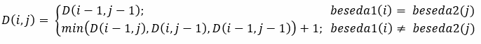

# Vaje 03. 03, Dinamično programiranje, 3.del

**Ime:** Gal Zakrajšek

**Datum:** 10.03.2021

---

Na vajah smo se lotili reševanja Levenshteinove razdalje. Na internetu smo našli podrobno opisan postopek in logiko, ki stoji za tem. Link je objavlen v virih.


## Komentarji in opombe

Všeč mi je bilo, da je vsaka skupina reševala drugo nalogo in nakoncu smo malo komentirali, da smo še ostalim razložili princip. 


## Organizacija dela

Delali smo v skupinah. V skupini nas je bilo veliko, vendar je bilo vse tekoče in tudi lepo smo sodelovali.


# Levenshteinova razdalja

**Navodilo:** Opis ideje

Ideja rekurzivne naloge je direktna, zato mislim, da te ne rabim posebej omenjati. Kar se tiče pa reševanja z dinamičnim programiranjem pa je ideja bolj zanimiva. 

V funkciji hranimo še dodatno matriko, ta ima npr v i-ti vrsti in j-tem stolpcu neko število, ki predstavlja število operacij, da iz prvih i črk prve besede sestavimo prvih j črk druge besede.

Za naš algoritem sprva zgeneriramo prazno matriko z eno vrsto in enim stolpec več kakor dolžine besed. Tam si predstavljamo 0 vrsto in 0 stolpec, ki jih zapolnimo kar z zaporednimi številkami, saj če si predstavljamo i=0 in j=3 bomo iz 0 črk prve besede potrebovali 3x operacijo dodaj, da bomo dobili prve 3 črke druge besede.

Sedaj imamo osnovno matriko z izpolnjeno prvo vrsto in stolpec. Tukaj potrebujemo samo še dve gnezdeni zanki in s tem poračunamo še ostale vrednosti po Bellmanovi enačbi v naslednjem poglavju. Ideja je ubistvu taka, da če imamo na neki točki dve različni črki, potem potrebujemo eno operacijo, da jih zamenjamo. Drugače ne potrebujemo nič, zato vzamemo število operacij pri eni črki pred njo.


**Navodilo:** Bellmanova enačba




**Navodilo:** Metoda z uporabo rekurzije

```python
def levenshteinovaRazdalja(a, b):
    '''Vrne levenshteinovo razdaljo med nizoma a in b'''
    if a == "":
        return len(b)
    if b == "":
        return len(a)
    if a[-1] == b[-1]:
        razdalja = 0
    else:
        razdalja = 1
    koncna_razdalja = min(levenshteinovaRazdalja(a[:-1], b) + 1,
                          levenshteinovaRazdalja(a,b[:-1]) + 1,
                          levenshteinovaRazdalja(a[:-1],b[:-1]) + razdalja)
    return koncna_razdalja
```

**Komentar:**
Kasneje smo se igrali tudi z velikostjo, da smo videli do kam rekurzivna metoda deluje dovolj hitro. Ugotovili smo, da tukaj hitreje pridemo do omejenosti rekurzivne globine, ki je v osnovi nastavljena na 1000. Tako ubistvu za nize, ki so daljši vrne napako. Seveda to globino se, da tudi povečati ampak to ni "poanta" te naloge.
 


**Navodilo:** Metoda z uporabo memoizacije

```python
def levenshteinovaRazdalja_DP(beseda1, beseda2):
    """
    Izracuna levensteinovo razdaljo za dve besedi oziroma stevilo operacij (dodaj, odstrani, zamenjaj),
    da iz prve naredimo drugo. To naredimo z pomocjo DP oziroma matrike.
    """
    razdalje = [[0 for i in range(len(beseda2) + 1)] for j in range(len(beseda1) + 1)]

    #cena sestavljanja iz praznega niza besede1
    for i in range(len(beseda1) + 1):
        razdalje[i][0] = i

    #cena sestavljanja iz praznega niza besede2
    for j in range(len(beseda2) + 1):
        razdalje[0][j] = j
    
    #primerjamo prejsnjega sestavljanja in vzamemo najmanjso stevilo operacij
    #v primeru, da se znaka razlikujeta pristejemo se 1 ker naredimo novo operacijo   
    for i in range(1, len(beseda1) + 1):
        for j in range(1, len(beseda2) + 1):
            if (beseda1[i-1] == beseda2[j - 1]):

                #v primeru da sta enaki potem imamo na diagonali bo vedno najmanjsa iz prejsnje iteracije
                razdalje[i][j] = razdalje[i - 1][j - 1]
            else:
                levo = razdalje[i][j - 1]
                gor = razdalje[i - 1][j]
                diagonala = razdalje[i - 1][j - 1]
                
                razdalje[i][j] = min(levo, gor, diagonala) + 1

    return razdalje[len(beseda1)][len(beseda2)]
```


**Komentar:**
Ta metoda uporablja memoizacijo in sicer tako, da si v matriki shranjuje število operacij, ki so potrebne za spreminjanje. 
 


# Viri

1. Measuring Text Similarity Using the Levenshtein Distance: Ahmed Fawzy Gad, pridobljeno s [https://blog.paperspace.com/measuring-text-similarity-using-levenshtein-distance/](10.03.2021)