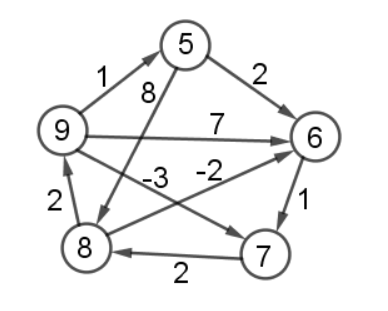

# Vaje 17.3.2022 Floyd Warshall

**Ime:** Gal Zakrajšek

**Datum:** 24.03.2022

---

Na vajah smo se pogovarjali o Floyd Warshallovem algoritmu za odkrivanje najkrajših poti med vsemi vozlišči.


## Komentarji in opombe

Vaje so bile zelo pogovorne, kar mi je bilo všeč. Super je tudi, da smo hodili na tablo, saj se s tem veliko naučiš. Problemi najkrajših poti so zanimivi.


# FLoyd Warshall

## 1. naloga
**Navodilo** Kaj računa in kako deluje Floyd Warshallov algoritem? Kakšna je časovna zahtevnost?

Imamo usmerjen graf G, ki je utežen. Pomembno je, da graf nima negativnih ciklov, vendar pa se v njem lahko pojavijo negativne uteži. Tako nam FW algoritem izračuna najkrajše poti med vsemi pari vozlišč.

$množica\ vozlišč = {v_1, v_2, v_3, ...., v_n}$

$P_i,j(k) = dolžina\ najkrajše\ poti\ med\ i\ in\ j\ kjer\ so\ vsa\ vmesna\ vozlišča\ v\ množici\ {v_1, ..., v_k}$

$P_{i,j}(k) = min(P_{i,j}(k-1),P_{i,k}(k-1) + P_{k,j}(k-1))$

Začetni pogoji $P_{i, i} = 0$ in pa nemogoča pot = $inf$

Časovna zahtevnost: $O(n^3)$

## 2. naloga
**Navodilo** Za spodnji graf izračunaj vse najkrajše poti s pomočjo Floyd Warshalovega algoritma:



<table>

Tabele<td>
$k = 0$
|   | 5   | 6   | 7   | 8   | 9   |
|---|-----|-----|-----|-----|-----|
| 5 | 0   | 2   | inf | 8   | inf |
| 6 | inf | 0   | 1   | inf | inf |
| 7 | inf | inf | 0   | 2   | inf |
| 8 | inf | -2  | inf | 0   | 2   |
| 9 | 1   | 7   | -3  | inf | 0   |

</td><td>


$k = 1$
|   | 5   | 6   | 7   | 8   | 9   |
|---|-----|-----|-----|-----|-----|
| 5 | 0   | 2   | inf | 8   | inf |
| 6 | inf | 0   | 1   | inf | inf |
| 7 | inf | inf | 0   | 0   | inf |
| 8 | inf | -2  | inf | 0   | 2   |
| 9 | 1   | 3   | -3  | 9   | 0   |


</td><td> 

$k = 2$
|   | 5   | 6   | 7  | 8   | 9   |
|---|-----|-----|----|-----|-----|
| 5 | 0   | 2   | 3  | 8   | inf |
| 6 | inf | 0   | 1  | inf | inf |
| 7 | inf | inf | 0  | 2   | inf |
| 8 | inf | -2  | -1 | 0   | 2   |
| 9 | 1   | 3   | -3 | 9   | 0   |

</td>
</table>

<table>

<td>

$k = 3$
|   | 5   | 6   | 7  | 8  | 9   |
|---|-----|-----|----|----|-----|
| 5 | 0   | 2   | 3  | 5  | inf |
| 6 | inf | 0   | 1  | 3  | inf |
| 7 | inf | inf | 0  | 2  | inf |
| 8 | inf | -2  | -1 | 0  | 2   |
| 9 | 1   | 3   | -3 | -1 | 0   |

</td><td> 

$k = 4$
|   | 5   | 6  | 7  | 8  | 9 |
|---|-----|----|----|----|---|
| 5 | 0   | 2  | 3  | 5  | 7 |
| 6 | inf | 0  | 1  | 3  | 5 |
| 7 | inf | 0  | 0  | 2  | 4 |
| 8 | inf | -2 | -1 | 0  | 2 |
| 9 | 1   | -3 | -3 | -1 | 0 |

</td><td> 

$k = 5$
|   | 5 | 6  | 7  | 8  | 9 |
|---|---|----|----|----|---|
| 5 | 0 | 2  | 3  | 5  | 7 |
| 6 | 6 | 0  | 1  | 3  | 5 |
| 7 | 5 | 0  | 0  | 2  | 4 |
| 8 | 3 | -2 | -1 | 0  | 2 |
| 9 | 1 | -3 | -3 | -1 | 0 |

</td>
</table>

**Dodatno Navodilo** Nato dodamo vozlišče 10 in povezavo (5 -> 10) z utežjo -1 in (10 -> 6) z utežjo 2. Kako uporabil prejšnje rezultate, da bi izračunal nove najkrajše poti?

Najprej bi v tabeli (k = 0) dodali vrsto in stolpec 10 z osnovno ceno povezav, ki so direktno povezani z 10. Potem v vseh tabelah (k = 1, 2, 3, 4, 5) popravimo samo to vrstico in stolpec. Na koncu naredimo še čisto novo tabelo k = 6 in jo v celoti poračunamo.\
Časovna zahtevnost: $O(n^2)$


## 3. naloga
**Navodilo** Na predavanjih ste poleg izračuna matrike D(n) izračunali tudi P(n). Kaj lahko iz njih razberemo? Kako dobimo najkrajšo pot med i in j?

$\Pi_{i,j}(k) = Zadnje\ vozlišče\ najkrajše\ poti\ med\ i\ in\ j\ preko\ {v_1, ..., v_k}$

Pot bi nato rekonstruirali z naslednjo kodo:
```python
def min_pot(pi_matrika, i, j):
    """
    Rekunstruira pot iz tabele pi, ki jo dobimo po koncu floyd washallovega algoritma.
    """
    sez = list()
    zac = i
    kon = j
    while zac != kon:
        sez.append(kon)
        kon = pi_matrika[zac][kon]
    sez.append(kon)
    return sez[::-1]
```

## 4. naloga
**Navodilo** Ali imamo v omrežju lahko več najkrajših poti med dvema vozliščema? Kaj FW naredi v tem primeru? Konstruiraj graf, ki ima ogromno najkrajših poti. Bi lahko preštel vse take poti?

FW bo v primeru dveh poti z isto ceno vrnil samo eno. Katero bo izbral, je odvisno od implementacije. Če je implementiran z navadnim minimumom bo vrnil prvo oziroma tisto ki ima najmanjše indekse v vozliščih.

Štetje najkrajših poti, bi lahko implementirali tako, da ko najdemo pot, ki je že enaka tudi naši trenutni potem jo dodamo v nek seznam. Na koncu, ko gledamo število vseh možnih najkrajših poti pogledamo zraven še te sezname, če je opcij več potem tukaj pomnožimo trenutno število poti z številom različnih opcij. Na kratko, ko dobimo vse načine za pot do enega vozlišča potem te načine množimo po celotni poti in dobimo končen rezultat.

## 5.naloga
**Navodilo** Kako bi s FW algoritmom odkrili, če v grafu obstajajo negativni cikli? Kaj vrne FW, če graf vsebuje negativen cikel?

V primeru negativnega cikla se lahko zgodijo čudne stvari. Čisto odvnisno kako je sestavljen tisti naš negativni cikel. Lahko se zgodi, da se enkrat sprehodi čez negativni cikel, lahko pa tudi večkrat.\
Takoj, ko se spremeni diagonala v naši matriki vemo, da je v grafu nek negativni cikel.


## 6.naloga
**Navodilo** Uteži sedaj dodamo še na vozlišča. Kako bi sedaj poiskal vse najkrajše poti?

Imamo dve ideje. Ena je taka, da naredimo dvojno povezavo in v dvojniku za ceno vzamemo to utež na vozlišču. Potem uporabimo osnovni FW algoritem.\
Druga ideja pa je da vse povezavam, ki kažejo v vozlišče prištejemo dano utež. Potem samo poženemo osnovni FW algoritem.
