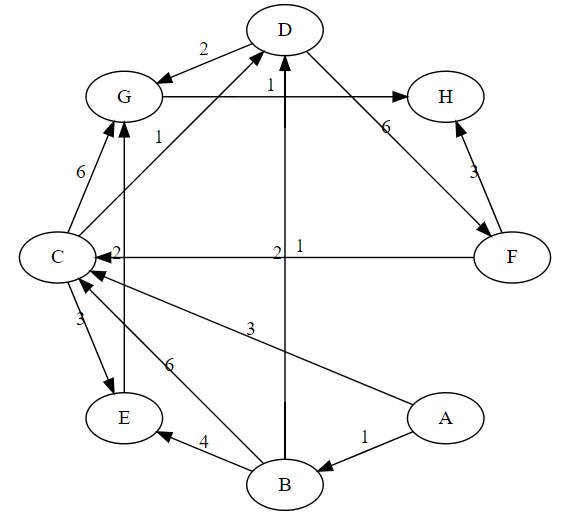

# Vaje 24.3.2022 Dijkstrov algoritem

**Ime:** Gal Zakrajšek

**Datum:** 03.04.2022


Na vajah smo obravnavali Dijsktrov algoritem. Rešili smo primer in pa ga tudi poskusili implementirati. Nato smo odgovarjali še na dodatna vprašanja o algoritmu. Pogledali smo si tudi kako deluje prioritetna vrsta in pa kopica.


## Komentarji in opombe

Vaje so bile vredu, saj smo ponovili delovanje algoritma in ga tudi implementirali. 


# Dijsktrov algoritem

Podatki: $Graf\ G(E, V)$, ki pa mora biti usmerjen in obtežen. Vse povezave morajo biti nenegativne.\
Vhodni podatki algoritma: $Graf\ G$ in začetno vozlišče $s \in V(G)$\
Izhod: Najkrajše poti od vozlišča $s$ do vseh ostalih vozlišč.\
Časovna zahtevnost $O(|V|^2)$

## 1. naloga
**Navodilo** Simuliraj Dijkstrov algoritem na spodnjem grafu.




Spodaj je tabela, ki bi jo vrnila dijsktra, če bi iskali potiz vozličša $A$ do vozlišča. $H$

|   | 0   | A   | B   | C   | D   | E   | G | H | F |
|---|-----|-----|-----|-----|-----|-----|---|---|---|
| A | **0**   |     |     |     |     |     |   |   |   |
| B | inf | **1**  |     |     |     |     |   |   |   |
| C | inf | 3   | **3**   |     |     |     |   |   |   |
| D | inf | inf | 3   | **3**   |     |     |   |   |   |
| E | inf | inf | 5   | 5   | **5**   |     |   |   |   |
| F | inf | inf | inf | inf | 9   | 9   | 9 |  **9** |   |
| G | inf | inf | inf | 9   | 5   | **5**   |   |   |   |
| H | inf | inf | inf | inf | inf | inf | **6** |  |   |


prioritetna vrsta
PQ = [...(p, v)...]

PQ.push((p, v)) ....... $O(log|PQ|)$\
PQ.pop() ............... $O(log|PQ|)$

Uporaba prioritetne vrste na grafih, ki so redki se ne splača. Zato je pomembno, da vemo na kakšnem grafu delamo dijsktro.


## 2. naloga
**Navodilo** Napiši algoritem (v čim bolj python sintaksi) s katerim si rešil zgornji problem. Probaj napisat še algoritem z uporabo prioritetne vrste. Primerjaj časovne zahtevnosti teh dveh algoritmov in komentiraj v katerih primerih bi uporabil kater algoritem. Primerjaj še z FW algoritmom iz prejšnjih vaj.

- Osnutek algoritma brez prioritetne vrste
```python
def DijkstraSez(G, S):
    """
    Naredi dikstro na danem grafu in zacetnem vozliscu S s pomočjo navadnih seznamov
    G - seznam sosednosti
    S - indeks v seznamu sosednosti
    O(|V|^2)
    """
    n = len(G)
    razd = [float("inf")] * n
    obisk = [False] * n
    razd[S] = 0
    q = set() #notri damo vsa vozlisca
    while q:
        minVoz = 2 #dobimo vozel po zadnjem obisku z najmanjso ceno #se iz q uzamemo
        doMin = razd[minVoz]
        for i, w in G[minVoz]:
            if  doMin + w < razd[i]:
                razd[i] = doMin + w
            obisk[minVoz] = True 
            q.remove(minVoz)
        return razd
```

- Osnutek algoritma z prioritetno vrsto
```python
def DijkstraQ(G, S):
    """
    Naredi dikstro na danem grafu in zacetnem vozliscu S s pomočjo vrste z prioriteto
    G - seznam sosednosti
    S - indeks v seznamu sosednosti
    O((|E| + |V|) * log(|E|))
    """
    n = len(G)
    razd = [float("inf")] * n
    obisk = [False] * n
    razd[S] = 0
    PQ = [(0, S)] #Prioritetna vrsta (tukaj samo prikazana in ni pravilna implementacija)
    while len(PQ) != 0:
        doMin, minVoz = PQ.pop()
        if obisk[minVoz]:
            continue
        obisk[minVoz] = True
        razd[minVoz] = doMin
        for i, w in G[minVoz]:
            if not obisk[i]:
                PQ.push((doMin + w), i)
    return razd
```

## 3. naloga
**Navodilo** Kako bi modificiral Dijkstrov algoritem, da bi poleg najcenejše vrnil še najkrajšo pot (ali kakšno drugo "sestavljeno" metriko")?

Poleg tabele z razdaljami, bi hranili še dodatno tabelo v katero bi shranjevali vozlišče, iz katerega smo v tistem trenutku našli najhitrejšo pot. Seveda, bi se ta vozlišča lahko večkrat prepisala (če najdemo boljšo pot). Na koncu imamo poleg tabele končnih razdalj še tabelo vozlišč, kjer imamo na $i$-tem indeksu napisano vozlišče iz katerega pridemo do $i$-tega vozlišča.

## 4. naloga
**Navodilo** Poizkusi opustiti predpostavko o nenegativnih utežeh, tako da vsem povezavam prišteješ tako število, da postanejo nenegativne. Kje je glavni problem tega pristopa?

Glavni problem tega pristopa je, da iščemo pot z najmanjšo ceno in ne z najmanjšim številom poti. V primeru, da bi imeli na začetku eno drago povezavo in pa alternativno pot iz večih povezav, ki so skupaj vseeno cenejše. Če tukaj prištejemo vsem povezavam neko število $k$, se tisti dragi povezavi poveča cena samo za $k$, medtem ko pa bi se alternativni poti, ker je sestavljena iz večih $m$ povezav povečala cena za $m * k$


# Viri

1. Dijkstra's Algorithm [https://www.programiz.com/dsa/dijkstra-algorithm](27.03.2021)