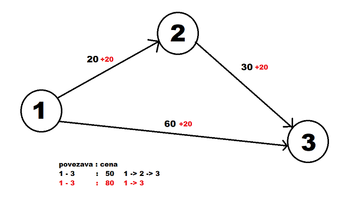

# Vaje 24. 03 in 31. 03, MVD 2.del, PNP uvod

**Ime:** Gal Zakrajšek

**Datum:** 07.04.2021

---

Na vajah in doma smo poskušali najti oziroma implementirati Primov, Dijkstrin in Floyd-Warshallov algoritem. Te nato izvesti na različnih 
grafih in primerjati čase izvajanja.

## Komentarji in opombe

Vaje so bile zanimive, saj nismo samo implementirali teh algoritmov ampak smo tudi videli, kako se obnašajo na različnih podatkih. Tudi ostali razmisleki, kako algoritem popraviti v primeru spremembe kakšne uteži so zanimivi, saj vidimo, da hitro postane problem, katerega optimalna rešitev še zdaj ni povsem znana.

## Organizacija dela

Prvič smo delali v skupinah, ki so jo sestavljali (Martin, Luka in jaz). Implementirali smo Primov algoritem s pomočjo interneta. Vse ostalo delo sem dokončal doma. 

# Minimalna vpeta drevesa

**Navodilo:** Implementacija Primovega algoritma in uporaba na grafih

Implementirajte verzijo Primovega algoritma s časovno zahtevnostjo O(V^2) za grafe predstavljene z matriko sosednosti. Implementacijo poženite na testnem grafu. Ko boste z njo zadovoljni, si izberite nekaj omrežij iz naslednjih virov, ter implementacijo preizkusite še na njih.

Implementiral sem algoritem s pomočjo spleta. Časovna zahtevnost algoritma je O(V^2), saj vsako vozlišče primerja z vsakim.
Implementacije nisem vključil v poročilo, je pa priložena zraven v datoteki "Prim.py". 
Notri so tudi funkcije, ki za različne grafe izračunajo čas izvajanja Primovega algoritma.

Prilagam sliko, kjer je razvidno približno koliko časa je Primov algoritem deloval za posamezne primere. Datoteko z 1.000.000 vozlišči sem izpustil, saj program že predolgo bere datoteke, kaj šele algoritem, ki bo delal s časovno zahtevnostjo O(V^2).

## Dodatne naloge

**Navodilo:** Poiščite algoritem, ki bo poiskal drugo najmanjše vpeto drevo (recimo, da je minimalno zakleto). Predpostavite lahko, da imajo povezave različne uteži.

Algoritem je tak, da vedno ko želimo najti n-to najmanjše vpeto drevo moramo zamenjati n-1 povezav.
Ideja je taka, da prvo najdemo najmanjše vpeto drevo. Rečemo, da so vse povezave v množici E. Nato eno povezavo iz T množice izbrišemo, tako dobimo dve vpeti drevesi. Sedaj moramo iz vseh povezav razen tistih v T najti najmanjšo povezavo, ki povezuje obe komponenti. Tako ponovno dobimo eno vpeto drevo, ki je drugo najmanjše.

Kako pa najdemo najmanšo povezavo, ki bo povezala dve komponenti? Načina sta dva.
1) Za vsak e, ki je povezava v T poiščemo neko drugo povezavo f tako, da bo razlika c(f) - c(e) najmanjša. Te cene primerjamo in najdemo tisto z najboljšo razliko. Na koncu to povezavo odstranimo in dodamo f, ki smo ga našli. To bo drugo najmanjše vpeto drevo.

2) Povezavo f, ki ni v množici E dodamo v drevo. Dobimo sedaj cikel in iz njega odstranimo najcenejšo povezavo, to bo ta naš e. To ponovimo za vse povezave, ki niso bile na začetku v množici T in primerjamo kdaj dobimo najmanjši cikel. To je na koncu drugi najmanjši cikel.

**Navodilo:** Pri vseh naslednjih nalogah imamo dan neusmerjen graf G z utežmi na povezavah ter minimalnim vpetim drevesom T. Vaš vhodni podatek je povezava e in nova utež, algoritmi pa morajo T popraviti tako, da bo minimalno drevo v spremenjenem grafu. Seveda bi lahko samo še enkrat izračunalni minimalno vpeto drevo v času O(E log V), ampak ste lahko hitrejši.

***Navodilo:*** Opišite algoritem, s katerim bi posodobili minimalno vpeto drevo, če zmanjšamo utež povezave e v T.

Algoritma ne potrebujemo, saj če zmanjšamo utež v povezavi, ki je že v T potem postane minimalno vpeto drevo še manjše in bo zagotovo najmanjše.

***Navodilo:*** Opišite algoritem, s katerim bi posodobili minimalno vpeto drevo, če zmanjšamo utež povezave e, ki ni v T.

Algoritem deluje tako, da to povezavo, ki ni v T dodamo v T in tako ponovno dobimo cikel. Iz njega nato izbrišemo najdražjo povezavo ter tako ponovno dobimo minimalno vpeto drevo.

***Navodilo:*** Opišite algoritem, s katerim bi posodobili minimalno vpeto drevo, če povečamo utež povezave e v T.

Algoritem bi deloval tako, da najprej izbrišemo povezavo e iz drevesa tako dobimo dve komponenti. Nato poiščemo vse povezave, ki niso v T in ki povežejo obe komponenti skupaj. Od vseh teh izberemo najcenejšo.

***Navodilo:*** Opišite algoritem, s katerim bi posodobili minimalno vpeto drevo, če povečamo utež povezave e, ki ni v T.

Algoritma ne potrebujemo, saj če zvečamo utež povezavi, ki ni v minimalnem vpetem drevo, ta nikakor ne bo vplival na minimalno vpeto drevo, saj bo še večja kot prej.

# Problem najmanjših poti

**Navodilo:** Dijkstrin algoritem najde drugačne najkrajše poti, če vsem utežem prištejemo neko konstanto. Poiščite najmanjši tak primer grafa (po številu vozlišč) in konstanto c (za tak graf) tako, da bo Dijkstrin algoritem našel drugačno pot med dvema vozliščema po tem, ko prištejemo c vsem utežem.

Na sliki se vidi, kako bi Dijkstrin algoritem vrnil drugačno minimalno pot(rdeča), če vsem prištejemo neko konstanto. Najmanjši primer grafa ima torej 3 vozlišča

**Navodilo:** Ali Dijkstrin algoritem deluje za usmerjene grafe? Če ja, ga moramo kako prilagoditi? Če ne, kakšen mora biti graf, kjer algoritem ne bo deloval pravilno (opis ali primer)?

Dijkstrin algoritem lahko deluje za usmerjene ali neusmerjene grafe. Pri usmerjenih je potrebno paziti, da lahko pridemo do vsakega vozlišča, saj drugače dijkstra nebi delovala. 

**Navodilo:** Kako bi prilagodili Dijkstrin algoritem, da bo našel vse najkrajše poti med vozlišči (in ne samo ene od njih)?

Algoritem bi prilagodil tako, da bi poleg trenutno najbolj optimalnih poti, beležil tudi po kakšni poti lahko pridemo do te točke. In tako bi potem, ko primerjamo če smo našli boljšo povezavo imeli še pogoj, če smo našli povezavo, ki je enako dolga kot trenutno najboljša. V tem primeru bi v tabelo kjer hranimo po kakšni poti pridemo do točke dodal še novo pot. 

## Uporaba implementacij na podatkih

Oba algoritma sem stestiral in delujeta.

**Dijsktra**
Časovna zahtevnost pri tem algoritmu je O(n^2) ampak za 10000 vozlišč je delovalo vseeno dokaj hitro. 
Prilagam sliko kako so časovne zahtevnosti delovali pri izvajanju dijkstre na podatnih grafih.

**Floyd-Warshall**
Časovna zahtevnost tukaj hitreje raste. Vseeno sem naredil program, ki preizkusi tudi grafe z 1000 in pa 10000 povezavami ampak mi jih časovno ni uspelo počakati. Pri časovni zahtevnosti O(n^3) smo že hitro na zelo visokih številkah

## Dodatna naloga

**Navodilo:** Kot pri MVD imamo podan graf G in vpeto drevo najkrajših poti T. Ponovno je vaš vhodni podatek povezava e in nova utež, algoritmi pa morajo T popraviti tako, da bo spet drevo najkrajših poti v spremenjenem grafu. Ste lahko kaj hitrejši kot Dijkstrin algoritem?

Tako kot zgoraj imamo dva primera, pri katerem ne rabimo narediti nič. Pri ostalih dveh pa je problem zapleten. Z njem se še zdaj ukvarjajo različni raziskovalci. Neke podrobnosti se najde, če googlamo Dijsktra shortest path dynamic.

# Viri

1. Dijkstra's Algorithm [https://www.programiz.com/dsa/dijkstra-algorithm](07.04.2021)
2. Floyd-Warshall Algorithm [https://www.programiz.com/dsa/floyd-warshall-algorithm](07.04.2021)