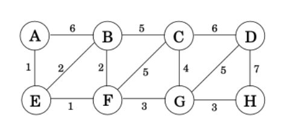
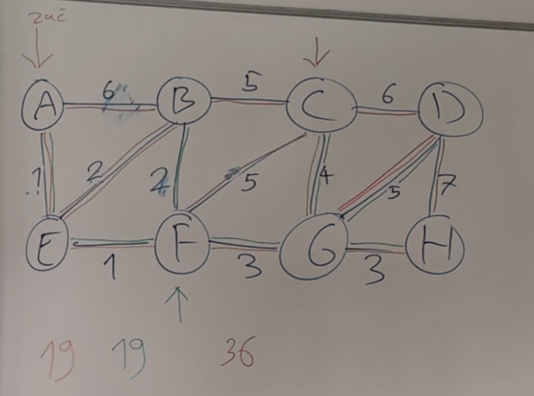

# Vaje 7.4.2022 Minimalna vpeta drevesa

**Ime:** Gal Zakrajšek

**Datum:** 14.04.2021

---

Na vajah smo se pogovarjali o Primovem algoritmu, ki rešuje problem minimalnega vpetega drevesa. Simulirali smo njegovo delovanje in potem obravnavali še iskanje najdražjega vpetega drevesa. Dokazovali smo tudi zakaj dobimo enolično minimalno vpeto drevo, če imamo graf, kjer so vse teže povezav različne. Na koncu smo se pogovarjali o ideji algoritma, ki bi poiskal drugo, tretje, ali katerokoli največje vpeto drevo.

## Komentarji in opombe

Vaje so bile dobre, saj se veliko več naučimo, če skupaj pogledamo problem in komentiramo. Zato mislim, da je bil tak pristop super.

## Primov algoritem

## 1. naloga
**Navodilo** Ponovitev Primovega algoritma (vhod, izhod, ideja algoritma, časovna zahtevnost)

Primov algoritem rešuje problem minimalnega vpetega drevesa v grafu.\
Vhodni podatek je graf. Kot izhod pa dobimo minimalno vpeto drevo. Če jih obstaja več, bo algoritem vrnil enega.\
Ideja algoritma je da v vsaki iteraciji dodamo neko vozlišče, do katerega lahko pridemo najcenejše. Vedno imamo graf razdeljen na dva dela.En del vsebuje vozlišča, ki smo jih že obravnavali, v drugem delu pa so vsi ostali. Hranimo povezave, ki kažejo iz vozlišč, ki smo jih že obravnavali in iščemo neko tako, ki bo kazala na vozlišče, ki še ni bilo obravnavano.\
Naivna časovna zahtevnost: $O(|V|^2)$\
Časovna zahtevnost če algoritem optimiziramo: $O(|E| * log|E|)$ Pri tem povezave, ki kažejo izven drevese dodajamo v prioritetno vrsto

## 2. naloga
**Navodilo** Simulacija Primovega algoritma na grafu:

Začeli smo iz vozlišča $A$.

## 3. naloga
**Navodilo** Pokaži, da je MVD enolično, če so vse uteži. v grafu različne. Namig: protislovje

Imamo graf $G$, ki ima vse uteži drugačne mi pa dokazujemo da dobimo samo eno min vpeto drevo.
(protislovje) Zanikamo desni del ==> imamo $T$ in $T'$ MVD in ker nista enolična $T != T'$. Kar pomeni, da imamo vsaj eno povezavo različno.\
Imamo povezave $e$, ki je v $T$ in ne v $T'$. Poleg tega imamo še $e'$, ki je v $T'$ in ne v $T$, ki ima najmanjšo utež.

Prvo $e'$ dodamo v $T$ in nastane cikel. Da spet dobimo eno drevo je potrebno eno povezavo odstraniti. V temu ciklu odstranimo povezavo $v \in T / T'$.\
Imamo novo drevo $T''$, to je $T + e' - v$ zdaj je teža\
$\omega(T'') = \omega(T) + \omega(e') - \omega(v)$ 
 
$\omega(e') - \omega(v) <= 0$ ker $\omega(e') <= \omega(v)$
 
$\omega(T) >= \omega(T'') => ker\ je\ T\ opt. => \omega(T) = \omega(T'')$ zato imamo

$0 = \omega(e') - \omega(v)$
 
$ \omega(e') = \omega(v)$ => dobimo protislovje. 

## 4. naloga
**Navodilo** Kako bi poiskal najdražje vpeto drevo?

Ideja iskanja je podobna. Uporabimo enak algoritem le, da tokrat dodajamo najdražje uteži (povezave) namesto najcenejših. 

## 5. naloga
**Navodilo** Naj bo T MVD in T' drevo najkrajših razdalj od vozlišča s do vseh ostalih. Vsaki uteži sedaj prištejemo 1. Ali se T in T' spremenita?

$T$ se ne spremeni. Prav tako v algoritmu vzamemo enake povezave.
Vsakemu vpetemu drevesu se poveča teža za $n-1$. saj so vsaka enako velika. Zato je $T$ še vedno minimalno vpeto drevo.

$T'$ se spremeni. Saj če imamo eno veliko povezavo in na drugi strani pot z veliko povezavami, se bo ta spremenil veliko več kot tista z eno veliko povezavo. Saj vsaki povezavi prištejemo 1.

## 6. naloga
**Navodilo** Recimo, da imamo utežen graf G in njegovo MVD T (eno izmed možnih). Sedaj določeni povezavi e spremenimo utež. Opiši čim bolj učinkovit algoritem, ki popravi T.

Imamo graf $G$ in minimalno vpeto drevo $T$. Obravnavamo dve možnosti: povezava, ki ji spreminjamo utež je vsebovana v $T$ ali pa ni v $T$. Potem pa imamo ali se utež spremeni negativno ali pozitivno

Obravnavamo vse možnosti:\
utež +, $e$ ni v $T$ => $T$ se ne spremeni
 
utež -, $e$ je v $T$ => $T$ se ne spremeni
 
utež +, $e$ je v $T$ => izbrišemo $e$ in tako nam drevo razpade na dve komponenti $T_1$ in $T_2$. Iščemo povezavo, ki ima eno vozlišče v $T_1$ in eno v $T_2$ in ima najmanjšo utež. To dodamo v $T$.
 
utež -, $e$ ni v $T$ => Dodamo $e$ v T in dobimo cikel. Potem iz cikla izbrišemo povezavo z največjo utežjo.

## 7. naloga
**Navodilo** Kako bi poiskal "drugo" najcenejše vpeto drevo? Tretje? Kako bi poiskal vsa MVD v grafu?
 
 Neka ideja:\
$F = množica\ vpetih\ dreves\ v\ grafu\ G... G = K_n => |F| = n^{n - 2}$\
Zgradimo graf $T(G)$:
- vozilišča so drevesa v $F$ .. $V(T(G)) = F$
- $T, T' \in F(G)$ sta soseda če: $T \cap T'| = k - 1$

Potem na T uporabimo dijkstro.

